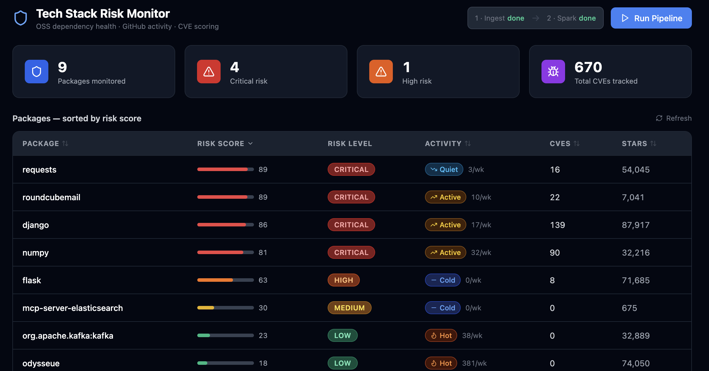

# Tech Stack Risk Monitor

A Big Data pipeline that scores the health and security risk of open-source dependencies your team relies on.

---

## Quick Start

```bash
# Copy env template and add your GitHub token
cp .env.example .env
#    → edit .env and set GITHUB_TOKEN=ghp_...
#    → edit config/packages.yaml to add/remove packages to monitor

# Start MongoDB, backend, and frontend
docker compose up -d --build
```

Access <http://localhost:5173> to view the fresh dashboard.

You can trigger ingestion + Spark processing directly from the dashboard by clicking the **Run Pipeline** button in the top-right corner.

You can update `config/packages.yaml` at any time and trigger a new run without restarting any service.

Or run each step manually:

```
# 1. Ingest data from GitHub + OSV (takes ~2-3 min, rate-limited by GitHub)
docker compose run --rm ingestion

# 2. Run Spark risk processing job
docker compose --profile tools run --rm processing
```



---

## Architecture

```
┌──────────────────────────────────────────────────────────────────┐
│  Ingestion Layer                                                  │
│  ┌──────────────┐   ┌──────────────────────────────────┐        │
│  │  GitHub API  │   │  OSV.dev  (CVE / vulnerability)  │        │
│  │  /stats/     │   │  POST /v1/query                  │        │
│  │  commit_act  │   └──────────────┬───────────────────┘        │
│  └──────┬───────┘                  │                             │
│         └──────────────┬───────────┘                             │
│                        ▼                                         │
│              MongoDB (raw collections)                           │
│         commit_weekly · vulnerabilities · packages               │
└─────────────────────────┬────────────────────────────────────────┘
                          │
┌─────────────────────────▼────────────────────────────────────────┐
│  Processing Layer (Apache Spark — local[*])                      │
│                                                                   │
│  commit_weekly ──► commit_trend_score UDF (linear regression)    │
│  vulnerabilities ► cve_score UDF (CVSS-weighted count)           │
│  composite_score = 0.4 × trend + 0.6 × cve                      │
│                        │                                         │
│                        ▼                                         │
│              MongoDB  risk_scores collection                      │
└─────────────────────────┬────────────────────────────────────────┘
                          │
┌─────────────────────────▼────────────────────────────────────────┐
│  Delivery Layer                                                   │
│  ┌───────────────────────────────┐  ┌────────────────────────┐   │
│  │  FastAPI  REST  /api/packages │  │  WebSocket /ws/alerts  │   │
│  │  GET · POST /pipeline/*       │  │  real-time CVE stream  │   │
│  └──────────────────┬────────────┘  └────────────┬───────────┘   │
│                     └─────────────────────────────┘              │
│                                   │                              │
│                     React Dashboard (Vite + Tailwind + Recharts) │
└──────────────────────────────────────────────────────────────────┘
```

## Services

| Service | Port | Description |
|---------|------|-------------|
| frontend | 5173 | React dashboard |
| backend | 8000 | FastAPI REST + WebSocket |
| mongodb | 27017 | Data store |

## API Endpoints

| Method | Path | Description |
|--------|------|-------------|
| GET | `/api/packages` | All packages sorted by risk score |
| GET | `/api/packages/{name}` | Detail for one package |
| GET | `/api/stats` | Aggregate counts |
| POST | `/api/pipeline/ingest` | Trigger ingestion (background) |
| POST | `/api/pipeline/process` | Trigger Spark job (background) |
| GET | `/api/pipeline/status` | Pipeline job status |
| WS | `/ws/alerts` | Real-time CVE alert stream |

## Risk Score Algorithm

| Component | Weight | Description |
|-----------|--------|-------------|
| `commit_trend_score` | 40% | Linear regression over 52 weekly commit counts. Declining or very low activity → higher score (riskier). |
| `cve_score` | 60% | CVSS-weighted count of CVEs in the past 2 years. More/worse CVEs → higher score. |
| `composite_score` | — | `0.4 × trend + 0.6 × cve` |

| composite_score | risk_level |
|-----------------|------------|
| 0 – 24 | LOW |
| 25 – 49 | MEDIUM |
| 50 – 74 | HIGH |
| 75 – 100 | CRITICAL |

## Data Sources

- **GitHub REST API** — `/repos/{owner}/{repo}/stats/commit_activity` (52 weeks of commit counts). No auth required, but rate-limited to 60 req/hr without a token.
- **OSV.dev** — `POST /v1/query` with package name + ecosystem. Free, no auth needed. Returns all known vulnerabilities.

## Monitored Packages (default)

Edit `config/packages.yaml` to add, remove, or change packages.

| Package | Ecosystem | GitHub |
|---------|-----------|--------|
| flask | PyPI | pallets/flask |
| django | PyPI | django/django |
| requests | PyPI | psf/requests |
| Pillow | PyPI | python-pillow/Pillow |
| numpy | PyPI | numpy/numpy |
| express | npm | expressjs/express |
| lodash | npm | lodash/lodash |
| axios | npm | axios/axios |
| log4j-core | Maven | apache/logging-log4j2 |

## Project Structure

```
risk-monitor/
├── docs/
│   └── screenshot.png
├── config/
│   └── packages.yaml       # list of OSS packages to monitor
├── ingestion/
│   ├── github_ingester.py  # GitHub commit stats fetcher
│   ├── cve_ingester.py     # OSV.dev CVE fetcher
│   ├── run_ingestion.py    # entry point
│   └── Dockerfile
├── processing/
│   ├── risk_processor.py   # PySpark batch job
│   └── Dockerfile
├── backend/
│   ├── main.py             # FastAPI app + WebSocket alerts
│   └── Dockerfile
├── frontend/
│   └── src/
│       ├── App.tsx
│       ├── api/client.ts
│       └── components/
│           ├── Dashboard.tsx
│           ├── PackageTable.tsx
│           ├── PackageDetail.tsx
│           ├── CommitChart.tsx
│           ├── RiskBadge.tsx
│           └── AlertToast.tsx
├── docker-compose.yml
└── .env.example
```
